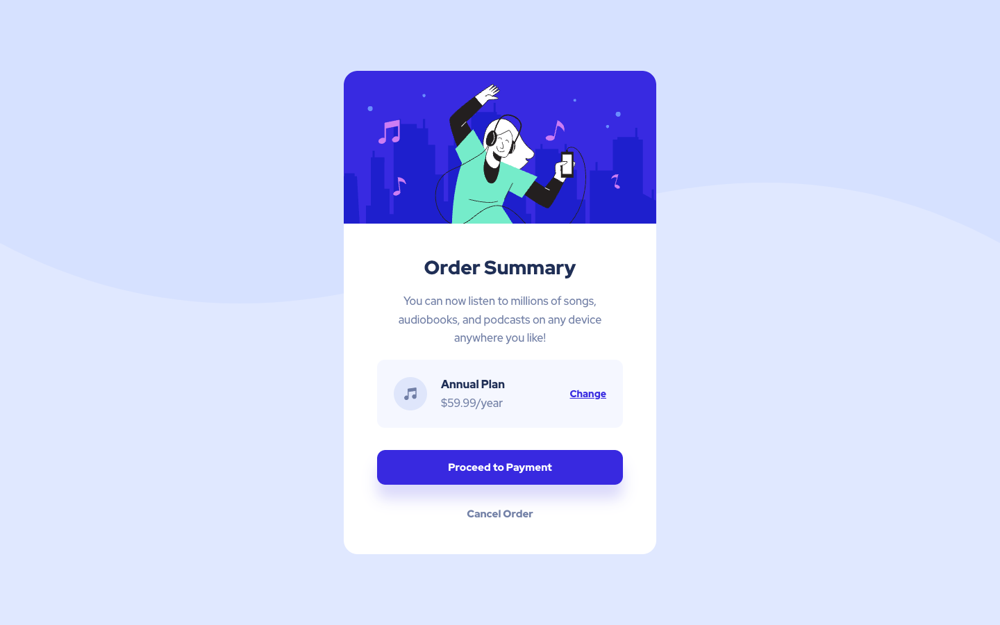

# Frontend Mentor - Order summary component solution

This is a solution to the [Order summary card challenge on Frontend Mentor](https://www.frontendmentor.io/challenges/order-summary-component-QlPmajDUj).
Frontend Mentor challenges help you improve your coding skills by building realistic projects.

## Table of contents

- [Overview](#overview)
  - [The challenge](#the-challenge)
  - [Screenshot](#screenshot)
  - [Links](#links)
- [My process](#my-process)
  - [Built with](#built-with)
  - [What I learned](#what-i-learned)
  - [Useful resources](#useful-resources)
- [Author](#author)

## Overview

### The challenge

Users should be able to:

- View the optimal layout depending on their device's screen size
- See hover states for interactive elements

### Screenshot



### Links

- Solution URL: [https://github.com/alkersan/order-summary-component](https://github.com/alkersan/order-summary-component)
- Live Site URL: [https://alkersan.github.io/order-summary-component/](https://alkersan.github.io/order-summary-component/)

## My process

### Built with

- Flexbox
- Mobile-first workflow
- [React](https://react.dev) - JS library
- [Styled Components](https://styled-components.com/) - For CSS
- [Vite](https://vitejs.dev) - Build tool

### What I learned
In this exercise, I wanted to avoid using the fixed-sized Hero image
and prevent the containing block from grow uncontrollably.
```js
const Wrapper = styled.div`
  width: fit-content;
  max-width: 327px;
  ...
  @media ${QUERIES.tabletAndUp} {
    max-width: 450px;
  }
`;
const Hero = styled.img`
  width: 100%;
  aspect-ratio: 45 / 22;
  object-fit: contain;
`;
```
The card can still shrink on small viewports (375px and less), and the image will not distort.

As a result, the Hero section can reserve enough space until the entire image is loaded,
which prevents the Layout Shift ([CLS](https://web.dev/articles/cls)).

### Useful resources

The course [css-for-js](https://css-for-js.dev) helped me immensely. 

## Author

- Frontend Mentor - [@alkersan](https://www.frontendmentor.io/profile/alkersan)
